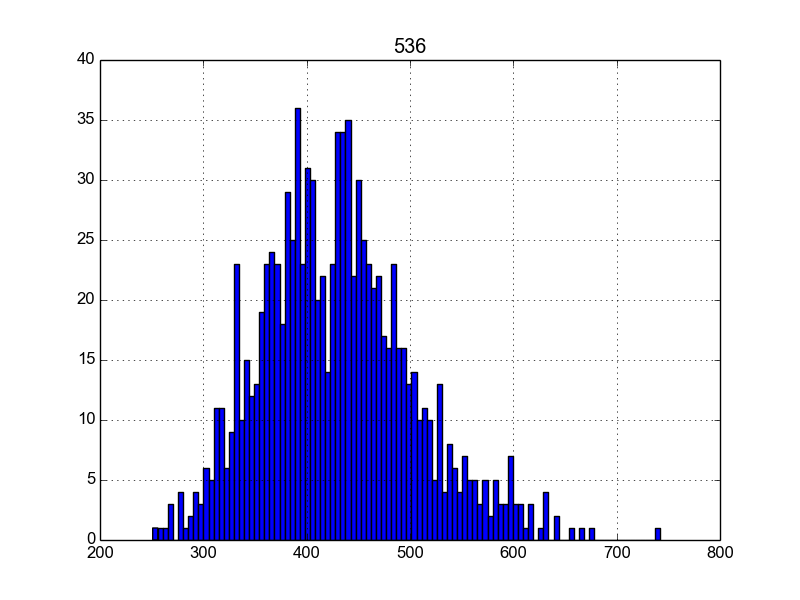
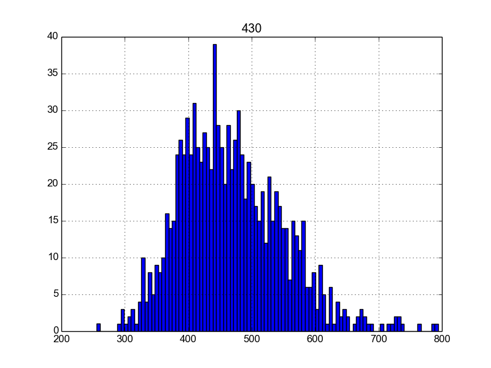
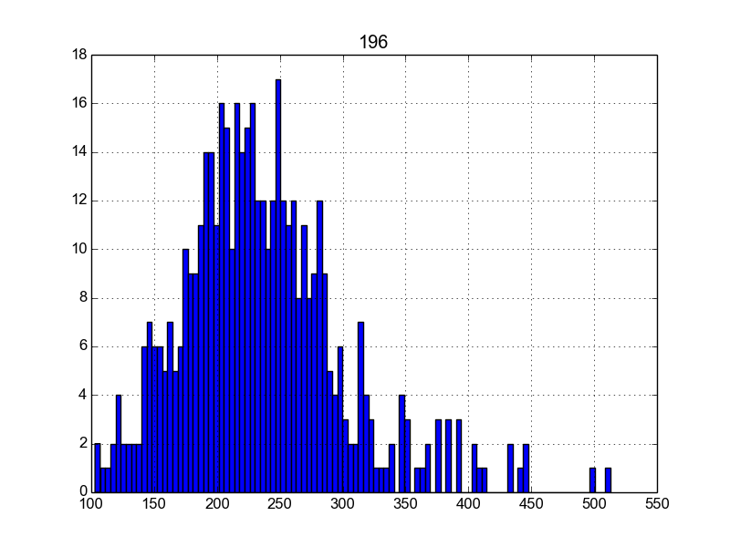
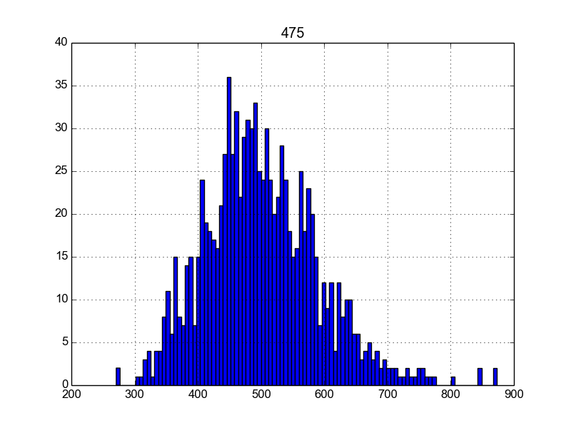
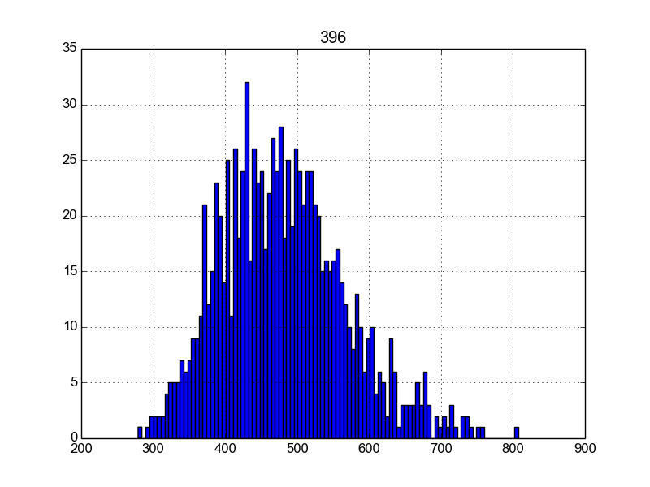

### Blackjack code

Hi! I wrote up a set of objects to play blackjack, and simulate
the basics of the game. it was an interesting exercise.

After a while, I wondered about the optimal strategy for placing
bets. I'm familiar with a couple of strategies, such as +/-1 or 
rules about hitting or standing when the value of a hand is 
above a certain number.

## Simulation code

I took my code and created a simulation to test out different
strategies. The total number of hands played was output for
1000 games of poker with the strategy

    df = pd.read_csv('col')
    df.hist(bins=100)
    plt.show()

No fancy data analysis for now, let's just load it up and
create a histogram with it.

## 16, hit or stand

When we have a more conservative strategy, we seem to get
a bigger spread of values. Some games go on as long as 17
but others seem to end kind of quicker, too

## 17, hit or stand

The dealer in this code always hits when its hand is below 17
and will stand when it's 17 or higher. 

Let's see what happens when our human player does something
similar.

## 17, hit or stand, randomly bet 1 to 3 dollars

Well, this was unfortunate. I'm willing to 'bet' that 
randomly betting is not a good strategy.

## 18, hit or stand

It seems like we get slightly better results with a more
aggresive strategy. It's interesting that there are a few
games that got to almost 1000 rounds!

## 19, hit or stand

Aggresive is good, until we get to here. It seems like we 
do very poorly.

